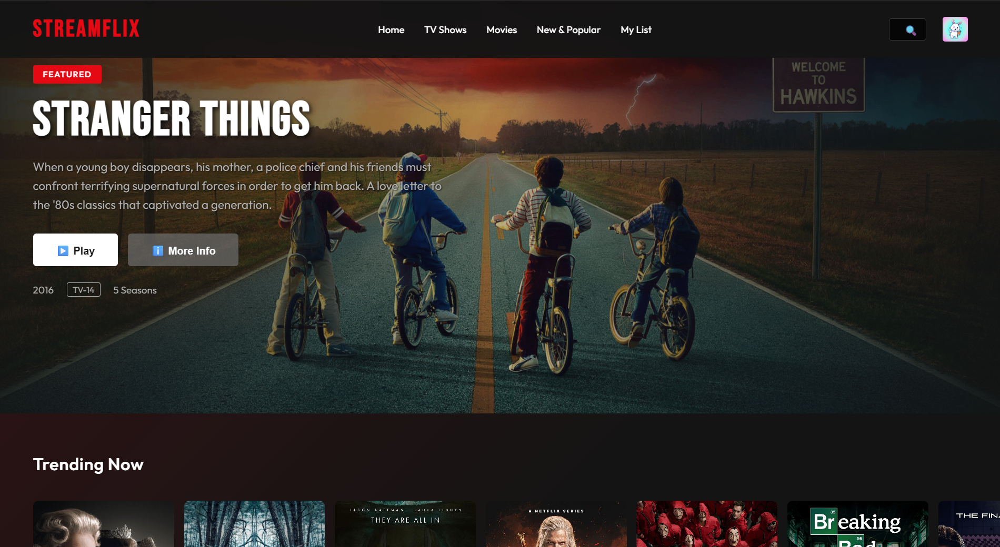

<div align="center">


# StreamFlix — Netflix Clone

### A cinematic streaming UI experience built with pure HTML, CSS & JavaScript

[](https://sumitbehera720.github.io/netflix-clone/)
[](https://github.com/sumitbehera720/netflix-clone/stargazers)
[](https://github.com/sumitbehera720/netflix-clone/network)
[](LICENSE)

<br/>

> 🎬 *A pixel-perfect, responsive Netflix-inspired streaming platform UI — crafted with zero frameworks, pure web technologies, and a passion for design.*

<br/>



</div>

---

## 📌 Table of Contents

- [About the Project](#-about-the-project)
- [Live Demo](#-live-demo)
- [Features](#-features)
- [Tech Stack](#-tech-stack)
- [Project Structure](#-project-structure)
- [Getting Started](#-getting-started)
- [Deployment](#-deployment)
- [Content Showcase](#-content-showcase)
- [Roadmap](#-roadmap)
- [Disclaimer](#-disclaimer)
- [Author](#-author)

---

## 🎯 About the Project

**StreamFlix** is a fully functional frontend clone of Netflix, designed to demonstrate proficiency in modern UI/UX principles and core web technologies. Built entirely without frameworks or libraries, it showcases clean code architecture, component-like design patterns, and a seamless, immersive user experience.

This project was built as part of a self-learning journey to master frontend development fundamentals — from responsive layouts and CSS animations to DOM manipulation and interactive UI components.

---

## 🌐 Live Demo

🔗 **[https://sumitbehera720.github.io/netflix-clone/](https://sumitbehera720.github.io/netflix-clone/)**

> Best experienced on a desktop browser at full width.

---

## ✨ Features

<table>
  <tr>
    <td>🎥</td>
    <td><strong>Hero Banner</strong></td>
    <td>Full-screen featured content with Play and More Info CTAs</td>
  </tr>
  <tr>
    <td>🔥</td>
    <td><strong>Trending Carousel</strong></td>
    <td>Smooth horizontally scrollable row of top trending titles</td>
  </tr>
  <tr>
    <td>▶️</td>
    <td><strong>Continue Watching</strong></td>
    <td>Personalized row of recently watched content</td>
  </tr>
  <tr>
    <td>🎭</td>
    <td><strong>Genre Rows</strong></td>
    <td>Curated sections — Action, Comedy, Thriller & more</td>
  </tr>
  <tr>
    <td>🪟</td>
    <td><strong>Content Modal</strong></td>
    <td>Detailed popup with cast, genres, director & awards</td>
  </tr>
  <tr>
    <td>➕</td>
    <td><strong>My List</strong></td>
    <td>Add and manage a personal watchlist</td>
  </tr>
  <tr>
    <td>🔍</td>
    <td><strong>Search UI</strong></td>
    <td>Expandable search bar in the navigation</td>
  </tr>
  <tr>
    <td>📱</td>
    <td><strong>Responsive Design</strong></td>
    <td>Optimized layout across all screen sizes</td>
  </tr>
  <tr>
    <td>🌑</td>
    <td><strong>Dark Theme</strong></td>
    <td>Netflix-authentic dark UI with cinematic aesthetics</td>
  </tr>
</table>

---

## 🛠️ Tech Stack

<div align="center">


</div>

| Layer | Technology | Purpose |
|-------|------------|---------|
| Structure | HTML5 | Semantic page layout and content |
| Styling | CSS3 | Animations, flexbox/grid, responsive design |
| Logic | Vanilla JavaScript | Carousels, modals, DOM manipulation |
| Hosting | GitHub Pages | Free, fast static site deployment |

---

## 📁 Project Structure

```
netflix-clone/
│
├── 📄 index.html          # Main HTML entry point
├── 🎨 style.css           # Global styles, animations & responsive rules
├── ⚙️  script.js           # All interactivity — carousels, modals, events
├── 🖼️  profile.jpeg        # User profile avatar
└── 📘 README.md           # Project documentation
```

---

## 🚀 Getting Started

### Prerequisites

No dependencies or build tools required. Just a modern web browser.

### 1. Clone the Repository

```bash
git clone https://github.com/sumitbehera720/netflix-clone.git
cd netflix-clone
```

### 2. Run Locally

**Option A — Open directly:**
```bash
# Simply open index.html in your browser
open index.html         # macOS
start index.html        # Windows
xdg-open index.html     # Linux
```

**Option B — Use a local server (recommended for best results):**
```bash
# Using Node.js
npx serve .

# Using Python
python -m http.server 8000
```

Then navigate to `http://localhost:8000` in your browser.

---

## 🌍 Deployment

This project is deployed on **GitHub Pages**. To deploy your own fork:

```bash
# Step 1: Fork this repository on GitHub

# Step 2: Go to your repo → Settings → Pages

# Step 3: Under "Source", select the main branch and / (root)

# Step 4: Save — your site will be live at:
# https://<your-username>.github.io/netflix-clone/
```

---

## 📺 Content Showcase

| Section | Titles Featured |
|---------|----------------|
| 🌟 **Featured** | Stranger Things |
| 🔥 **Trending Now** | 10 handpicked popular titles |
| ▶️ **Continue Watching** | Black Mirror, The Office, Narcos, Peaky Blinders, Vikings |
| 💥 **Action & Adventure** | Extraction, Red Notice, The Gray Man, 6 Underground, Army of the Dead |
| 😄 **Comedies** | Brooklyn Nine-Nine, Parks and Rec, The Good Place, Arrested Development, Schitt's Creek |

---

## 🗺️ Roadmap

- [x] Hero banner with featured content
- [x] Horizontally scrollable content rows
- [x] Content detail modal
- [x] My List functionality
- [ ] Working search with live filtering
- [ ] User authentication UI
- [ ] Video player integration
- [ ] Dark/Light mode toggle
- [ ] Mobile hamburger menu

---

## ⚠️ Disclaimer

This project is built **purely for educational and portfolio purposes**. It is **not affiliated with, endorsed by, or connected to Netflix, Inc.** in any way. All show titles, images, and trademarks are the property of their respective owners and are used here solely for demonstrative purposes.

---

## 👨‍💻 Author

<div align="center">

**Sumit Behera**

*Frontend Developer | UI Enthusiast*

[](https://github.com/sumitbehera720)

<br/>

⭐ **If you found this project helpful or inspiring, please consider giving it a star!** ⭐

</div>

---

<div align="center">

© 2025 StreamFlix Clone · Designed & Developed with ❤️ by **Sumit Behera**

</div>
